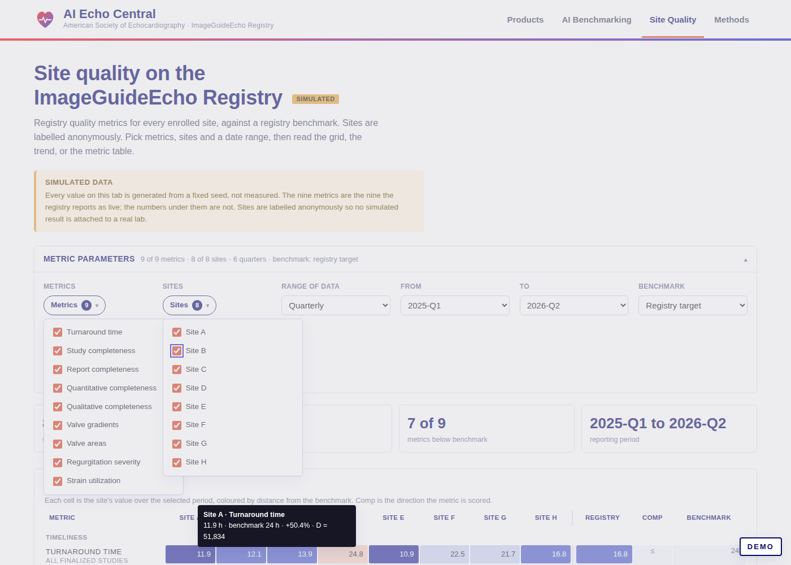

# AI Echo Central

An American Society of Echocardiography [ImageGuideEcho Registry](https://www.asecho.org/practice-clinical-resources/imageguideecho-registry/) project. Catalog of FDA-cleared AI echocardiography products, with a second tab that scores each product against the registry’s adult TTE module.

- **Products tab.** Every 510(k) and De Novo on FDA’s AI-enabled device list that operates on cardiac ultrasound. Each product carries its clearance history, indications, the performance metrics reported in its FDA summary (with verbatim quotes and page numbers), training and validation sample sizes where disclosed, prior validations, resolved publications, and registered trials.
- **Registry Performance tab.** The evaluation design, wired to the registry’s adult TTE data elements and quality metrics. Scores are synthetic from a fixed seed until the first evaluation cycle runs.
- **Methods tab.** Inclusion and exclusion rules, sources, verification levels, product codes, and excluded clearances.


## Deploy

Static site, no build step, no server code. Any static host works.

**GitHub Pages:** Settings → Pages → Source: *Deploy from a branch* → branch `main` (or this branch), folder `/ (root)`. The `.nojekyll` file is already present so `data/` and `assets/` are served as-is.

**Local:** open `index.html` directly, or serve the folder:

```
python3 -m http.server 8080
```

Data files are plain scripts (`data/products.js`, `data/registry.js`) so the page works from `file://` as well as over HTTP.

## Layout

```
index.html                 page markup (four tabs, detail panel)
assets/style.css           ASE tokens, light and dark themes, components
assets/app.js              filters, search, sort, cards/table, panel, registry charts, site quality grids
data/products.js           GENERATED catalog (scripts/build-data.mjs)
data/registry.js           GENERATED placeholder registry evaluation and site quality data (scripts/gen-registry.mjs)
data/research/             inputs: openFDA records, FDA AI list CSV, family seed, verified research JSON per batch
scripts/build-data.mjs     merge research + openFDA -> data/products.js
scripts/gen-registry.mjs   seeded synthetic registry data -> data/registry.js
scripts/refresh-openfda.mjs re-pull openFDA records; list new candidate clearances
scripts/validate.cjs       headless render check (desktop + mobile), console errors, screenshots
docs/screenshots/          regenerated by validate.cjs
```

## Data provenance

| Field | Source | Level shown in UI |
|---|---|---|
| Decision date, product code, applicant, device name | openFDA 510(k) endpoint | FDA database |
| Indications, predicates, performance metrics, dataset descriptions, flags | 510(k) summary / De Novo decision summary PDF (accessdata.fda.gov), text-extracted | FDA summary (page cited) |
| Publications | PubMed E-utilities and Crossref; shown as resolved only when the DOI or PMID resolved and the title matched | DOI resolved / PMID resolved / Unresolved |
| Company site, product page, deployment, press-reported validations | Vendor site, press release, trade press | Company / News |
| Registry tab | `scripts/gen-registry.mjs`, seed `20260905` | Synthetic |

Research JSON files in `data/research/` were produced by extraction agents reading the FDA summary text, then re-checked by an adversarial pass that verified every quoted claim against the source text, every date and code against openFDA, and every DOI against Crossref. Files ending in `.verified.json` are the checked copies; the build prefers them. Blank fields mean *not disclosed*, never zero.

Inclusion and exclusion rules are on the Methods tab. ECG-based estimators of echo phenotypes, stethoscope software, cardiac CT/MR software, and non-cardiac ultrasound AI are excluded and listed there with reasons.

## Update procedure

1. `node scripts/refresh-openfda.mjs` refreshes `data/research/openfda_records.json` and prints new candidate clearances under AI-specific product codes with cardiac ultrasound keywords.
2. Add each new family (or new K-number) to `data/research/families.json`. Download and read its FDA summary; write or update the research JSON with quotes, pages, and verification levels. Leave unknown numbers null.
3. `node scripts/build-data.mjs` — rebuilds `data/products.js` and prints warnings for any date or code that disagrees with openFDA.
4. `node scripts/gen-registry.mjs` — regenerates the placeholder registry data for the current family list.
5. `node scripts/validate.cjs` — renders the site headless, asserts filters, panel, table, registry and methods work at desktop and phone widths, fails on console errors, and refreshes `docs/screenshots/`. Needs Playwright with Chromium (`PLAYWRIGHT_MODULE=/path/to/playwright` if it is installed globally).
6. Commit the regenerated data and screenshots with the code.

## Replacing the simulated registry data

`data/registry.js` exposes `window.AIECHO_REGISTRY` with a `products` array: each entry has an anonymous `id` and `label`, plus cohort, endpoints (value, 95% CI, reference), subgroups and a monthly series. Products, sites and scanner vendors are all anonymised on purpose, so no generated number sits next to a real name; the catalog order is shuffled with the seed before labels are assigned.

A real evaluation should write the same shape with `simulated: false`, which clears the banner and the Simulated tag. Keep the endpoint ids (`lvef_mae`, `auc`, `diag_quality`, …) so the charts keep working. Charts show the leading 10 rows per finding and state how many were left out.

## Site quality data

The same file carries a `quality` object for the Site Quality tab:

- `quality.metrics` — the nine metrics the registry reports as live. Each has an `id`, a `section`, a `label`, a `short` label, a `unit` (`%` or `h`), a `direction` (`higher` or `lower`), a numerator and denominator description, a `benchmark` (the registry target), a `median` across sites, and a registry-wide `registry_value` with its own `n` / `d` and monthly series.
- `quality.sites` — eight anonymised sites (`Site A` … `Site H`) with a setting, study volume, staffing counts, an image-quality mix, and one entry per metric holding the site value, numerator, denominator, rank, and a monthly series where every month carries its own `n` and `d`.
- `quality.months` and `quality.quarters` — the selectable intervals.

Cell colour comes from the percentage distance to the benchmark, in four steps each side of a within-1% band: blue better, red worse, grey within. The ramp lives in CSS as `--dv-w4` … `--dv-b4` with a neutral `--dv-0`, defined for both themes. Quarters, period totals and the registry roll-up are denominator-weighted, so they are pooled rates rather than averages of rates.

The tab's controls are all live: metric and site multi-selects, monthly or quarterly intervals, a from/to range, a benchmark source (registry target or median), an N/D toggle, and a CSV export of the current view.

## Demo wash

The AI Benchmarking and Site Quality tabs carry generated numbers, so both are stamped: a flat light-grey overlay at 45% opacity (`.demo-wash`, `--demo-wash` per theme) fixed over the viewport, plus a `DEMO` badge above it. Both are `pointer-events: none`, so the page underneath stays fully usable. `DEMO_TABS` in `assets/app.js` controls which tabs get it; remove a tab from that list once its numbers are real.

## Screenshots




