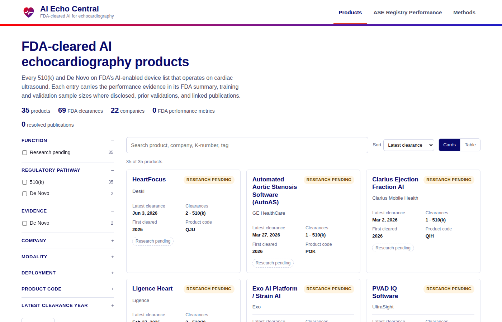
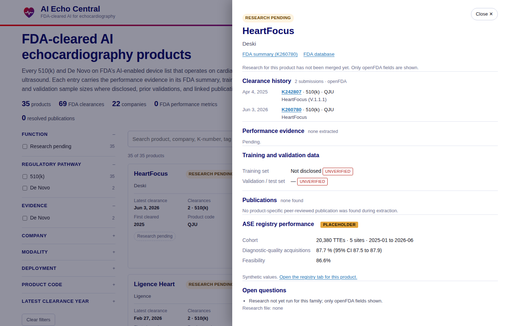
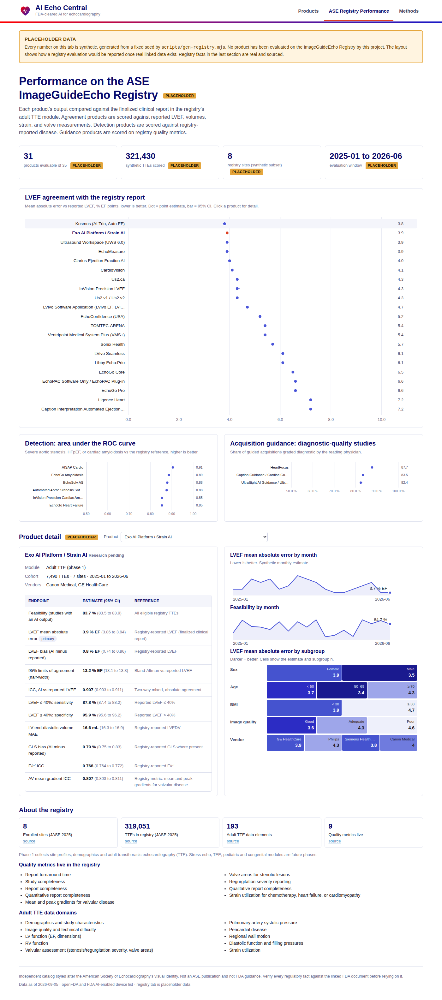
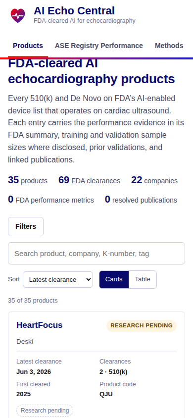

# AI Echo Central

Catalog of FDA-cleared AI echocardiography products, styled on the American Society of Echocardiography identity, with a second tab that shows how each product would be scored on the ASE ImageGuideEcho Registry.

- **Products tab.** Every 510(k) and De Novo on FDA’s AI-enabled device list that operates on cardiac ultrasound. Each product carries its clearance history, indications, the performance metrics reported in its FDA summary (with verbatim quotes and page numbers), training and validation sample sizes where disclosed, prior validations, resolved publications, and registered trials.
- **ASE Registry Performance tab.** Placeholder. Every number is synthetic and seeded. The layout mirrors the registry’s real adult TTE data elements and quality metrics so a real evaluation can drop in later.
- **Methods tab.** Inclusion and exclusion rules, sources, verification levels, product codes, excluded clearances, and build warnings.

Not an ASE publication. Not FDA guidance. Verify regulatory facts against the linked FDA document before relying on them.

## Deploy

Static site, no build step, no server code. Any static host works.

**GitHub Pages:** Settings → Pages → Source: *Deploy from a branch* → branch `main` (or this branch), folder `/ (root)`. The `.nojekyll` file is already present so `data/` and `assets/` are served as-is.

**Local:** open `index.html` directly, or serve the folder:

```
python3 -m http.server 8080
```

Data files are plain scripts (`data/products.js`, `data/registry.js`) so the page works from `file://` as well as over HTTP.

## Layout

```
index.html                 page markup (three tabs, detail panel)
assets/style.css           ASE tokens, light and dark themes, components
assets/app.js              filters, search, sort, cards/table, panel, registry charts
data/products.js           GENERATED catalog (scripts/build-data.mjs)
data/registry.js           GENERATED placeholder registry evaluation (scripts/gen-registry.mjs)
data/research/             inputs: openFDA records, FDA AI list CSV, family seed, verified research JSON per batch
scripts/build-data.mjs     merge research + openFDA -> data/products.js
scripts/gen-registry.mjs   seeded synthetic registry data -> data/registry.js
scripts/refresh-openfda.mjs re-pull openFDA records; list new candidate clearances
scripts/validate.cjs       headless render check (desktop + mobile), console errors, screenshots
docs/screenshots/          regenerated by validate.cjs
```

## Data provenance

| Field | Source | Level shown in UI |
|---|---|---|
| Decision date, product code, applicant, device name | openFDA 510(k) endpoint | FDA database |
| Indications, predicates, performance metrics, dataset descriptions, flags | 510(k) summary / De Novo decision summary PDF (accessdata.fda.gov), text-extracted | FDA summary (page cited) |
| Publications | PubMed E-utilities and Crossref; shown as resolved only when the DOI or PMID resolved and the title matched | DOI resolved / PMID resolved / Unresolved |
| Company site, product page, deployment, press-reported validations | Vendor site, press release, trade press | Company / News |
| Registry tab | `scripts/gen-registry.mjs`, seed `20260905` | Placeholder |

Research JSON files in `data/research/` were produced by extraction agents reading the FDA summary text, then re-checked by an adversarial pass that verified every quoted claim against the source text, every date and code against openFDA, and every DOI against Crossref. Files ending in `.verified.json` are the checked copies; the build prefers them. Blank fields mean *not disclosed*, never zero.

Inclusion and exclusion rules are on the Methods tab. ECG-based estimators of echo phenotypes, stethoscope software, cardiac CT/MR software, and non-cardiac ultrasound AI are excluded and listed there with reasons.

## Update procedure

1. `node scripts/refresh-openfda.mjs` refreshes `data/research/openfda_records.json` and prints new candidate clearances under AI-specific product codes with cardiac ultrasound keywords.
2. Add each new family (or new K-number) to `data/research/families.json`. Download and read its FDA summary; write or update the research JSON with quotes, pages, and verification levels. Leave unknown numbers null.
3. `node scripts/build-data.mjs` — rebuilds `data/products.js` and prints warnings for any date or code that disagrees with openFDA.
4. `node scripts/gen-registry.mjs` — regenerates the placeholder registry data for the current family list.
5. `node scripts/validate.cjs` — renders the site headless, asserts filters, panel, table, registry and methods work at desktop and phone widths, fails on console errors, and refreshes `docs/screenshots/`. Needs Playwright with Chromium (`PLAYWRIGHT_MODULE=/path/to/playwright` if it is installed globally).
6. Commit the regenerated data and screenshots with the code.

## Replacing the placeholder registry data

`data/registry.js` exposes `window.AIECHO_REGISTRY` with one evaluation per family id: cohort, endpoints (value, 95% CI, reference), subgroups, monthly series. A real evaluation should write the same shape with `placeholder: false`; the banner and tags read that flag. Keep the endpoint ids (`lvef_mae`, `auc`, `diag_quality`, …) so the charts keep working.

## Screenshots





