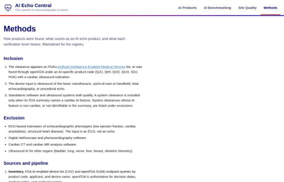
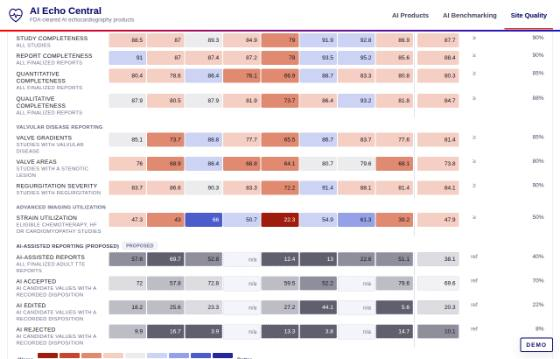

# AI Echo Central

An American Society of Echocardiography [ImageGuideEcho Registry](https://www.asecho.org/practice-clinical-resources/imageguideecho-registry/) project. Catalog of FDA-cleared AI echocardiography products, with a second tab that scores each product against the registry’s adult TTE module.

- **AI Products tab.** Every 510(k) and De Novo on FDA’s AI-enabled device list that operates on cardiac ultrasound. Each product carries its clearance history, indications, the performance metrics reported in its FDA summary (with verbatim quotes and page numbers), training and validation sample sizes where disclosed, prior validations, resolved publications, and registered trials.
- **Registry Performance tab.** The evaluation design, wired to the registry’s adult TTE data elements and quality metrics. Scores are synthetic from a fixed seed until the first evaluation cycle runs.
- **Methods tab.** Inclusion and exclusion rules, sources, verification levels, product codes, and excluded clearances.


## Deploy

Static site, no build step, no server code. Any static host works.

**GitHub Pages:** Settings → Pages → Source: *Deploy from a branch* → branch `main` (or this branch), folder `/ (root)`. The `.nojekyll` file is already present so `data/` and `assets/` are served as-is.

**Local:** open `index.html` directly, or serve the folder:

```
python3 -m http.server 8080
```

Data files are plain scripts (`data/products.js`, `data/registry.js`) so the page works from `file://` as well as over HTTP.

## Layout

```
index.html                 page markup (four tabs, detail panel)
assets/style.css           ASE tokens, light and dark themes, components
assets/app.js              filters, search, sort, cards/table, panel, registry charts, site quality grids
data/products.js           GENERATED catalog (scripts/build-data.mjs)
data/registry.js           GENERATED placeholder registry evaluation and site quality data (scripts/gen-registry.mjs)
data/thumbs.js             GENERATED view thumbnails as data URIs (scripts/make-thumbs.cjs)
data/research/             inputs: openFDA records, FDA AI list CSV, family seed, verified research JSON per batch
scripts/build-data.mjs     merge research + openFDA -> data/products.js
scripts/gen-registry.mjs   seeded synthetic registry data -> data/registry.js
scripts/refresh-openfda.mjs re-pull openFDA records; list new candidate clearances
scripts/make-thumbs.cjs    captures each view and writes data/thumbs.js + docs/thumbs/*.jpg
scripts/validate.cjs       headless render check (desktop + mobile), console errors, screenshots
docs/screenshots/          regenerated by validate.cjs
docs/thumbs/               regenerated by make-thumbs.cjs
```

## Data provenance

| Field | Source | Level shown in UI |
|---|---|---|
| Decision date, product code, applicant, device name | openFDA 510(k) endpoint | FDA database |
| Indications, predicates, performance metrics, dataset descriptions, flags | 510(k) summary / De Novo decision summary PDF (accessdata.fda.gov), text-extracted | FDA summary (page cited) |
| Publications | PubMed E-utilities and Crossref; shown as resolved only when the DOI or PMID resolved and the title matched | DOI resolved / PMID resolved / Unresolved |
| Company site, product page, deployment, press-reported validations | Vendor site, press release, trade press | Company / News |
| Registry tab | `scripts/gen-registry.mjs`, seed `20260905` | Synthetic |

Research JSON files in `data/research/` were produced by extraction agents reading the FDA summary text, then re-checked by an adversarial pass that verified every quoted claim against the source text, every date and code against openFDA, and every DOI against Crossref. Files ending in `.verified.json` are the checked copies; the build prefers them. Blank fields mean *not disclosed*, never zero.

Inclusion and exclusion rules are on the Methods tab. ECG-based estimators of echo phenotypes, stethoscope software, cardiac CT/MR software, and non-cardiac ultrasound AI are excluded and listed there with reasons.

## Update procedure

1. `node scripts/refresh-openfda.mjs` refreshes `data/research/openfda_records.json` and prints new candidate clearances under AI-specific product codes with cardiac ultrasound keywords.
2. Add each new family (or new K-number) to `data/research/families.json`. Download and read its FDA summary; write or update the research JSON with quotes, pages, and verification levels. Leave unknown numbers null.
3. `node scripts/build-data.mjs` — rebuilds `data/products.js` and prints warnings for any date or code that disagrees with openFDA.
4. `node scripts/gen-registry.mjs` — regenerates the placeholder registry data for the current family list.
5. `node scripts/validate.cjs` — renders the site headless, asserts filters, panel, table, registry and methods work at desktop and phone widths, fails on console errors, and refreshes `docs/screenshots/`. Needs Playwright with Chromium (`PLAYWRIGHT_MODULE=/path/to/playwright` if it is installed globally).
6. Commit the regenerated data and screenshots with the code.

## Replacing the simulated registry data

`data/registry.js` exposes `window.AIECHO_REGISTRY` with a `products` array: each entry has an anonymous `id` and `label`, plus cohort, endpoints (value, 95% CI, reference), subgroups and a monthly series. Products, sites and scanner vendors are all anonymised on purpose, so no generated number sits next to a real name; the catalog order is shuffled with the seed before labels are assigned.

A real evaluation should write the same shape with `simulated: false`, which clears the banner and the Simulated tag. Keep the endpoint ids (`lvef_mae`, `auc`, `diag_quality`, …) so the charts keep working. Charts show the leading 10 rows per finding and state how many were left out.

## Site quality data

The same file carries a `quality` object for the Site Quality tab:

- `quality.metrics` — thirteen metrics, each carrying `status`: nine `live` (the nine the registry reports as live, `source: JASE 2025`) and four `proposed` (AI-assisted reporting, proposed by this project). Each has an `id`, `code`, `section`, `label`, `short` label, `unit` (`%` or `h`), `direction` (`higher`, `lower` or `neutral`), numerator and denominator descriptions, a `benchmark` (live) or `reference` (proposed), a `median` across sites, and a registry-wide `registry_value` with its own `n` / `d` and monthly series.
- `quality.sites` — eight anonymised sites (`Site A` … `Site H`) with a setting, study volume, staffing counts, an image-quality mix, an `ai_capture` level, and one entry per metric holding the site value, numerator, denominator, rank, and a monthly series where every month carries its own `n` and `d`.
- `quality.months` and `quality.quarters` — the selectable intervals.

Cell colour comes from the percentage distance to the benchmark, in four steps each side of a within-1% band: blue better, red worse, grey within. The ramp lives in CSS as `--dv-w4` … `--dv-b4` with a neutral `--dv-0`, defined for both themes. Quarters, period totals and the registry roll-up are denominator-weighted, so they are pooled rates rather than averages of rates.

The tab's controls are all live: metric and site multi-selects, monthly or quarterly intervals, a from/to range, a benchmark source (registry target or median), an N/D toggle, and a CSV export of the current view.

## Sites at a glance

The Site Quality tab opens with one card per enrolled site. Each card carries nine tiles, one per metric in registry section order, coloured by the same benchmark bands as the grid below it, plus the site's study volume, how many metrics sit below benchmark, and its image-quality mix. The whole card is a link to `#quality/<siteId>`, which opens that site's scorecard.

Tiles encode **level only**. The monthly series is generated noise, so trend shape is deliberately not drawn on the cards — plotting it would imply site behaviour the model does not produce. (An earlier generator used one site-indexed sine for all nine metrics, which made every metric in a site move together at r = 0.62; each metric now carries its own phase and period, and the mean within-site cross-metric correlation is −0.06.)

## Views and deep links

`scripts/make-thumbs.cjs` loads each view in a headless browser, screenshots it, downscales it in-page to 560px wide and writes `data/thumbs.js` (JPEG data URIs) plus `docs/thumbs/*.jpg`. The Methods tab renders them as a **Views** gallery: each thumbnail is captioned and links to `https://douyang.github.io/ASERegistryExample/` at the exact hash route it shows, so a reader of a static copy — the single-file bundle, an artifact, a document — can jump to the interactive version.

Two properties are enforced rather than assumed:

- Figures are captured from the running page, so the demo wash, the DEMO badge and the SIMULATED banner are in the pixels, not applied as page furniture around them.
- The product-detail figure reports the id of the product it actually opened, so its link tracks the catalog instead of pointing at a hardcoded slug. `validate.cjs` checks that every figure hash is a real route and that every product id in a figure link exists in the catalog.

Thumbnails are data URIs rather than file paths because the artifact viewer blocks external image URLs; the same markup then works served, opened as a file, and inlined in the bundle. `bundle-single.mjs` inlines `data/thumbs.js` and its unresolved-reference guard now covers `docs/` as well as `assets/` and `data/`.

Selection also writes to the address bar: choosing a site or a simulated product updates the hash via `replaceState`, so the link to the current view can be copied. Routes: `#products`, `#registry`, `#quality`, `#methods`, `#product/<family-id>`, `#registry/<p01..p43>`, `#quality/<s1..s8>`.

## AI-assisted reporting metrics (proposed)

Four metrics measure how AI is used in the reporting workflow: the AI-assisted report rate, and the three dispositions of an AI candidate value — accepted unedited, edited, rejected. They are **not** among the registry's nine live metrics and are marked `Proposed` everywhere they appear.

Design rules the code enforces:

- **The three dispositions share one denominator and sum to 100%.** Accept and reject alone would not: the common interaction is correcting the AI result, not taking or discarding it. `gen-registry.mjs` draws the composition so `n_accepted + n_edited + n_rejected == d` exactly in every month; `validate.cjs` asserts the count identity is exact and the pooled shares close at 100%.
- **Denominators differ.** The disposition metrics count candidate values (one study offers several automated fields); the report rate counts reports. They are never summed or averaged together.
- **Direction is `neutral`.** A lab that accepts every AI value has not improved, it has changed what its signature means; a lab with no AI cannot be scored. Neutral metrics carry no rank, are excluded from the below-benchmark tallies, and export as `reference (no better or worse side)` in the CSV.
- **Neutral cells use a hueless grey distance scale** (`--nd-0` … `--nd-4`, chroma ≤ 0.022) rather than the diverging ramp, so a far-from-reference cell can never be read as the "better" blue. Ink is set per step per theme because no single threshold clears 4.5:1 in both.
- **A site that cannot export per-element AI provenance reads as not submitted, never as zero**, which would be indistinguishable from a lab that uses no AI. Two of the eight sites are generated that way on purpose, so the path is exercised.
- **Reference values are illustrative placeholders.** No measurement, guideline or published distribution sets them.

## Detection is scored one task at a time

Severe aortic stenosis, cardiac amyloidosis, HFpEF and coronary disease on stress echo are different detection problems with different registry prevalences (1.2% to 11.4%) and different references. A pooled ROC curve across them compares nothing, so each task gets its own chart.

`quality.detection_tasks` in `data/registry.js` names each task, its reference and its prevalence. `min_products_per_chart` (2) is the threshold: a task is charted only where at least that many cleared products address it, and the rest are named under **Detection tasks not charted** with their product count. The same threshold now applies to every chart on the tab, so a single-product comparison chart is never drawn.

Task assignment happens in `evalType()` in `scripts/gen-registry.mjs`. Order matters there: `aortic stenosis` is tested before the coronary terms, because `cadx` is the FDA product-code term for computer-assisted diagnostic software and sits on the AS products too — matching it as a task label put four AS products in the coronary bucket.

## AI benchmarking is one-off, not live

Benchmarking runs are point-in-time analyses of a dated, frozen registry extract, so there is no month-to-month view. Every evaluation states which extract it used (`dataset`: label, extract date, study period, extract size, inclusion rule) and when it ran (`analysis`: type, run date, protocol version). Products are scored against different extracts, so the charts either say which extracts they pool or are pinned to one with the **Dataset** picker.

## Demo wash

The AI Benchmarking and Site Quality tabs carry generated numbers, so both are stamped: a flat light-grey overlay at 45% opacity (`.demo-wash`, `--demo-wash` per theme) fixed over the viewport, plus a `DEMO` badge above it. Both are `pointer-events: none`, so the page underneath stays fully usable. `DEMO_TABS` in `assets/app.js` controls which tabs get it; remove a tab from that list once its numbers are real.

## Screenshots





